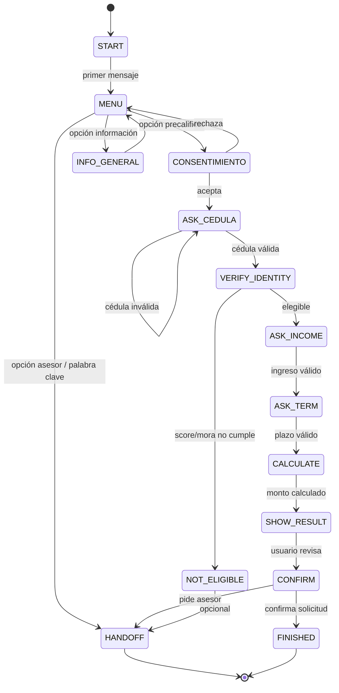

# CrediBot v2 — Requisitos, flujo real y arquitectura propuesta

**Documento de trabajo para revisión del equipo y del profesor**  
**Versión:** 0.5 (decisiones finales del equipo)  
**Fecha:** julio 2026  
**Estado:** Propuesta — pendiente de validación final del equipo  
**Opción del curso:** C — Agente conversacional de ventas/créditos por WhatsApp (CrediBot)

---

## 1. Propósito de este documento

Este documento redefine el proyecto **CrediBot** a partir del feedback recibido: el flujo actual **no representa un proceso crediticio real**. El sistema existente (máquina de estados + regla simple `monto/plazo vs ingreso`) funciona como demo técnica, pero **no verifica identidad**, **no consulta historial crediticio**, **no usa IA generativa**, **no expone tools/RAG** y **no tiene CI/CD en un proveedor cloud serio**.

Este MD consolida:

- Requisitos funcionales y no funcionales de la **versión 2**.
- Alineación con la **guía oficial del profesor** (Opción C, entregables, herramientas y políticas).
- Un **flujo conversacional realista** de precalificación de crédito.
- La **arquitectura técnica** propuesta (IA + tools + RAG + BD + WhatsApp + CI/CD).
- Los **entregables académicos** obligatorios (backlog, sprints, diagramas, demo en vivo).
- **Sugerencias de tecnología** con alternativas.
- La **estructura de carpetas** objetivo del repositorio.
- Preguntas abiertas para cerrar la versión final con el profesor.

---

## 1.1 Alineación con la guía del profesor (Opción C)

El profesor definió **CrediBot** como un agente conversacional en WhatsApp para **precalificación de crédito** (o asesoría/venta de producto), con flujo guiado y derivación a humano. Este documento **extiende** esos requisitos con el feedback adicional del profesor (flujo crediticio real, tools, RAG, verificación por cédula) sin contradecir la rúbrica del curso.

### Requisitos del profesor → cómo los cubre CrediBot v2

| Requisito del profesor (Opción C) | Cómo lo cubrimos en v2 |
|---|---|
| Flujo conversacional estructurado (saludo, intención, recolección paso a paso) | Flujo guiado por estados de negocio + IA conversacional |
| Lógica de precalificación (`preaprobado`, `observado`, `no_cumple`) | Reglas en `domain/credit_rules.py` + tool `calcular_monto_maximo` |
| Estado de conversación por usuario (no mezclar contextos) | `state_manager` + BD (PostgreSQL/Supabase); Redis opcional para caché |
| Derivación permanente a humano | Opción de menú + palabras clave + casos de riesgo → `derivar_a_asesor` |
| Registro de conversaciones y resultados | Tablas `messages`, `credit_requests`, `tool_audit_logs` + dashboard |
| Plantillas transaccionales | Templates de WhatsApp para confirmación de precalificación |
| WhatsApp Cloud API (sandbox) o Twilio Sandbox | **Meta Cloud API (entorno de prueba)** como opción principal |
| Modelar flujo como **máquina de estados** | Diagrama de estados en Mermaid (sección 7.2) — **enfoque híbrido validado por el profesor** |
| Modelar reglas de negocio de precalificación | `domain/credit_rules.py` + documentación RAG |
| Modelar mecanismo de traspaso humano-bot | `handoff_service` + tabla `handoff_cases` |
| Cumplimiento Meta: tarea específica + salida a humano | Precalificación de crédito + opción “Hablar con asesor” siempre visible |
| Entorno de prueba, sin datos personales reales | Perfiles crediticios **ficticios** en seed de BD |
| Uso de IA declarado y defendible | Sección 15.1 — declaración obligatoria en README |

### Feedback adicional del profesor (más allá de la guía escrita)

| Feedback | Respuesta en v2 |
|---|---|
| El flujo actual no es real | Verificación por cédula + historial crediticio + score desde BD |
| Usar tools y RAG conectados a BD | Tools de function calling + RAG sobre políticas de crédito |
| CI/CD en cloud (AWS, Azure, GCP) | GitHub Actions + deploy en Cloud Run / Azure / AWS (sección 11) |
| Modelo de IA para respuestas | OpenAI GPT con API key del equipo — **híbrido con máquina de estados (aprobado)** |
| Más mensajes que el Sandbox de Twilio (50/día) | Migrar a Meta Cloud API (entorno de prueba sin ese límite) |

---

## 2. Diagnóstico del sistema actual (v1)

| Aspecto | Estado actual | Problema |
|---|---|---|
| Flujo conversacional | Máquina de estados fija (`MENU → ASK_NAME → ASK_AMOUNT → ...`) | No refleja un proceso crediticio real |
| Verificación de identidad | Solo pide nombre | No valida que la persona exista ni que sea quien dice ser |
| Historial / score crediticio | No existe | No se puede saber si la persona es elegible |
| Motor de decisión | Fórmula estática en Python | No considera deudas previas, mora, score, políticas |
| IA | No hay modelo generativo | Respuestas rígidas, sin comprensión de lenguaje natural |
| Tools / RAG | No implementado | El modelo no consulta BD ni documentos de política |
| WhatsApp | Twilio Sandbox (~50 conversaciones/día) | Insuficiente; migrar a Meta Cloud API (prueba) |
| CI/CD | Despliegue manual en Render | Falta pipeline automatizado build + test (obligatorio) |
| Entregables ágiles | Parcial (`tareas.md`) | Faltan sprints documentados, diagramas Mermaid, retrospectiva |
| Cumplimiento | Consentimiento de datos no formalizado | Debe usarse solo datos ficticios (política del curso) |

**Conclusión:** La v1 sirve como base de código (FastAPI, Supabase, webhook, panel admin), pero debe evolucionar a un **agente de crédito con verificación real, tools y RAG**.

---

## 3. Objetivos de CrediBot v2

1. Actuar como un **bot de crédito real** orientado a precalificación, no a aprobación final.
2. **Verificar identidad** del solicitante mediante cédula consultada en base de datos.
3. **Consultar historial crediticio y score** antes de continuar el flujo.
4. Determinar **elegibilidad** y **monto máximo estimado** con reglas de negocio + datos reales.
5. Usar un **modelo de IA (GPT)** para conversación natural, orquestando **tools** y **RAG**.
6. Operar por **WhatsApp** con volumen de mensajes adecuado para desarrollo y demostración.
7. Desplegar con **CI/CD** (GitHub Actions) y contenedor Docker en la nube.
8. Mantener trazabilidad: conversaciones, decisiones, consultas a tools y derivaciones a asesor humano.
9. Cumplir **entregables académicos** del curso (backlog, sprints, diagramas, demo en vivo).
10. Usar **solo datos ficticios** de personas (política del curso — sin cédulas ni datos reales).

---

## 4. Alcance

### 4.1 Dentro del alcance (MVP v2)

- Precalificación de crédito por WhatsApp.
- Consulta de cédula → historial crediticio + score (desde BD del proyecto).
- Conversación guiada por IA con tools para consultas estructuradas.
- RAG sobre políticas de crédito, FAQs y condiciones del producto.
- Panel administrativo para revisar solicitudes y casos derivados.
- Pipeline CI/CD con **build + test** (obligatorio) y despliegue a cloud o Docker documentado.
- Simulador local / endpoint de prueba sin depender de WhatsApp.
- **Entregables ágiles:** backlog, ≥2 sprints, story mapping, diagramas Mermaid, retrospectiva.
- **Plantillas transaccionales** de WhatsApp para confirmaciones.

### 4.2 Fuera del alcance (MVP v2)

- Desembolso real de dinero.
- Integración directa con buró de crédito nacional en producción (se simula o se usa BD propia del proyecto).
- Firma electrónica de contratos.
- App móvil nativa.
- KYC biométrico avanzado (selfie, OCR de documento) — *sugerido como mejora futura*.

---

## 5. Requisitos funcionales

### RF-01 — Canal WhatsApp

- El sistema debe recibir y enviar mensajes por WhatsApp mediante webhook.
- Debe usar **WhatsApp Cloud API (entorno de prueba/sandbox de Meta)** como canal principal, conforme a la guía del profesor.
- Debe soportar un volumen **mayor** al Twilio Sandbox (~50 conversaciones/día) — ver sección 8.
- Debe validar firma/autenticidad del proveedor en producción.
- Debe cumplir políticas de Meta: tarea de negocio específica (precalificación) y salida a humano siempre disponible.

### RF-02 — Verificación de identidad por cédula

- El bot debe solicitar la **cédula** (10 dígitos, Ecuador) del solicitante.
- Debe validar formato y dígito verificador (módulo 10).
- Debe consultar en BD si la cédula existe y recuperar datos básicos (nombre, estado).
- Si la cédula no existe o no coincide con el titular, el flujo debe detenerse o derivar a asesor.

### RF-03 — Consulta de historial crediticio y score

- Mediante **tool** `consultar_perfil_crediticio(cedula)`, el sistema debe obtener:
  - **Score crediticio ecuatoriano** (escala **1–999**, referencia Equifax/burós locales).
  - Categoría de riesgo derivada del score (Excelente, Aceptable, Regular, Alto Riesgo).
  - Historial: créditos activos, mora, calificación, deuda total.
  - Flags de riesgo (ej. `en_mora`, `sin_historial`, `lista_negra`).
- La consulta debe registrarse en auditoría (quién, cuándo, qué se consultó).

### RF-04 — Decisión de elegibilidad (score Ecuador)

Antes de preguntar montos, el sistema determina si la persona **puede acceder** a un crédito según la escala crediticia usada en Ecuador (1–999 puntos):

| Categoría | Rango de score | Perfil de riesgo | Acción del bot |
|---|---|---|---|
| **Excelente** | 750 – 999 | Riesgo muy bajo | Continuar precalificación → resultado favorable (`preaprobado` si capacidad de pago lo permite) |
| **Aceptable** | 550 – 749 | Riesgo moderado | Continuar precalificación → puede resultar `preaprobado` u `observado` según ingreso y deuda |
| **Regular** | 349 – 549 | Retrasos o sobreendeudamiento | Precalificación con **monto reducido** → resultado `observado`; derivar a asesor recomendado |
| **Alto Riesgo** | < 349 | Morosidad alta o impagos | **No elegible** → explicar motivo + ofrecer hablar con asesor |

**Reglas adicionales** (aplican sobre cualquier categoría):

| Condición | Acción |
|---|---|
| Cédula inválida o no encontrada en BD | Rechazar / derivar a asesor |
| Mora activa > 30 días | No elegible automático → derivar a asesor |
| Sin historial crediticio (`thin file`) | Tratar como **Regular** → flujo `observado` con monto conservador |
| Usuario en lista negra | No elegible → derivar |

### RF-05 — Precalificación de monto

- Tras verificar elegibilidad, el bot hace preguntas para estimar capacidad:
  - Ingreso mensual neto.
  - Tipo de empleo / antigüedad laboral.
  - Gastos fijos mensuales (opcional).
  - Plazo deseado.
  - Destino del crédito.
- Una **tool** `calcular_monto_maximo(...)` combina score, ingreso, deuda existente y políticas.
- El bot presenta: monto máximo sugerido, cuota estimada, plazo y resultado (`preaprobado`, `observado`, `no_cumple`).

### RF-06 — Motor de IA con tools

- El modelo **GPT** (API key del equipo) debe:
  - Mantener conversación natural en español.
  - Invocar tools cuando necesite datos de BD o cálculos.
  - No inventar scores ni montos: siempre obtenerlos de tools.
- Tools mínimas:

| Tool | Descripción |
|---|---|
| `validar_cedula` | Formato + dígito verificador |
| `consultar_perfil_crediticio` | Historial + score por cédula |
| `verificar_identidad` | Cruza cédula con nombre declarado |
| `calcular_monto_maximo` | Calcula techo de crédito y cuota |
| `registrar_solicitud` | Guarda solicitud en BD |
| `registrar_mensaje` | Persiste turno de conversación |
| `derivar_a_asesor` | Crea caso de handoff |
| `obtener_politica_credito` | RAG: consulta documentos de política |

### RF-07 — RAG (Retrieval-Augmented Generation)

- Indexar documentos internos:
  - Políticas de crédito de la cooperativa/entidad.
  - Tasas, plazos, montos mínimos/máximos.
  - FAQs (requisitos, documentos, tiempos de respuesta).
  - Glosario financiero.
- El modelo usa RAG para responder dudas **sin inventar** condiciones fuera de los documentos.
- Fuente de verdad: archivos Markdown/PDF en repo + metadata en BD.

### RF-08 — Consentimiento y privacidad

- Antes de pedir la cédula, el bot debe informar:
  - Qué datos se recopilan.
  - Para qué se usan.
  - Que es una **precalificación**, no aprobación final.
- Registrar `consentimiento_otorgado = true` con timestamp.

### RF-09 — Derivación humana

- **Siempre** ofrecer opción “Hablar con asesor” / “Hablar con una persona” (requisito Meta y del profesor).
- Derivar a asesor cuando:
  - Score en zona gris.
  - Usuario lo solicita explícitamente.
  - Fallos repetidos de validación.
  - Casos fuera de política automática.

### RF-09b — Plantillas transaccionales (WhatsApp)

- Usar **message templates** aprobados por Meta para:
  - Confirmación de precalificación registrada.
  - Notificación de derivación a asesor.
- Mensajes de sesión (respuestas del bot) pueden ser de texto libre dentro de la ventana de 24 h.

### RF-10 — Gestión de estado de conversación (Supabase + Redis)

Arquitectura de **doble capa** confirmada por el equipo:

| Capa | Tecnología | Responsabilidad |
|---|---|---|
| **Persistencia** | Supabase (PostgreSQL) | Usuarios, conversaciones, mensajes, solicitudes, perfiles crediticios, auditoría |
| **Sesión activa** | **Redis** | Estado actual del flujo, contexto reciente, contadores de validación, caché de turno |

- Mantener estado por usuario (`conversation_id`) para no mezclar contextos entre clientes.
- **Redis** almacena el estado de sesión activa para respuestas rápidas en el webhook de WhatsApp.
- **Supabase** es la fuente de verdad: al cerrar conversación, timeout o derivación, el estado se sincroniza a PostgreSQL.
- El `state_manager` controla transiciones; la IA no cambia el estado directamente sin validación del backend.

**Claves Redis sugeridas:**

```text
session:{phone}           → { state, conversation_id, user_id, updated_at }
session:{phone}:failures  → contador de validaciones fallidas
session:{phone}:context   → últimos N turnos para el agente GPT
```

**Proveedor Redis recomendado para Cloud Run:** Upstash Redis (serverless, free tier) o Google Memorystore.

### RF-11 — Panel administrativo

- Mantener y extender el dashboard Streamlit:
  - Solicitudes con score e historial resumido.
  - Casos derivados.
  - Logs de tools invocadas por conversación.
  - Métricas de conversión del embudo.

### RF-12 — Simulador y pruebas

- Endpoint `POST /simulate/message` para probar el agente sin WhatsApp.
- Suite de pruebas unitarias e integración para tools y reglas de negocio.

---

## 6. Requisitos no funcionales

| ID | Requisito |
|---|---|
| RNF-01 | Tiempo de respuesta del bot < 8 s (p95), incluyendo llamada a GPT |
| RNF-02 | Disponibilidad objetivo ≥ 99% en horario de demo |
| RNF-03 | Secretos (API keys, tokens) solo en variables de entorno / secret manager |
| RNF-04 | Logs estructurados (JSON) con `conversation_id`, `tool`, `latency` |
| RNF-05 | Idempotencia en webhook de WhatsApp (evitar respuestas duplicadas) |
| RNF-06 | Cifrado en tránsito (HTTPS) y en reposo (BD gestionada) |
| RNF-07 | CI/CD: cada push a `main` pasa tests antes de desplegar |
| RNF-08 | Presupuesto OpenAI del MVP: techo ≈ **$10 USD**; limitar tokens y preferir modelo económico |

---

## 7. Flujo conversacional real propuesto

El flujo combina dos capas exigidas por el profesor:

1. **Máquina de estados** (modelado ágil obligatorio) — controla en qué paso del proceso crediticio está cada usuario.
2. **Agente IA (GPT + tools + RAG)** — genera respuestas naturales y ejecuta consultas, pero **no decide sola** la elegibilidad ni los montos.

> La IA conversa; el **estado de negocio y las reglas** las controla el backend.

### Decisión validada con el profesor

**Enfoque híbrido aprobado:** el sistema combina una **máquina de estados** (modelado obligatorio del curso) con un **agente GPT** que genera respuestas naturales e invoca **tools/RAG**. El LLM no reemplaza las reglas de negocio ni decide elegibilidad o montos por sí solo.

### Estilo de flujo: estructurado (decisión del equipo)

El flujo **no** es chat libre abierto. Cada paso es obligatorio y secuencial:

1. Bienvenida / menú  
2. Consentimiento  
3. Cédula  
4. Verificación de identidad + score  
5. Preguntas de precalificación (ingreso, plazo, destino)  
6. Cálculo y resultado  
7. Confirmación o handoff  

La IA solo **redacta** el mensaje del paso actual y puede responder dudas vía RAG **sin saltarse el estado**. Si el usuario pregunta algo fuera de turno, el bot responde brevemente y vuelve a pedir el dato del estado actual.

```text
Usuario (WhatsApp)
      │
      ▼
┌─────────────────┐
│ state_manager   │  ← máquina de estados (controla el paso del flujo)
└────────┬────────┘
         ▼
┌─────────────────┐
│  Agente GPT     │  ← redacta respuestas, detecta intención, invoca tools
└────────┬────────┘
         ▼
┌─────────────────┐
│  Tools + RAG    │  ← consultan BD, calculan montos, recuperan políticas
└────────┬────────┘
         ▼
┌─────────────────┐
│ domain/rules    │  ← elegibilidad y montos (Python, no el LLM)
└─────────────────┘
```

### 7.1 Diagrama de flujo de negocio

```text
┌─────────────┐
│   INICIO    │  Usuario escribe por WhatsApp
└──────┬──────┘
       ▼
┌─────────────┐
│ BIENVENIDA  │  IA saluda + menú + aviso de precalificación
└──────┬──────┘
       ▼
┌─────────────┐
│ CONSENTIM.  │  Usuario acepta tratamiento de datos
└──────┬──────┘
       ▼
┌─────────────┐
│  CÉDULA     │  Solicita cédula → tool: validar_cedula
└──────┬──────┘
       ▼
┌─────────────┐
│ VERIFICAR   │  tool: consultar_perfil_crediticio + verificar_identidad
│  IDENTIDAD  │
└──────┬──────┘
       │
       ├── No elegible ──► Explicar motivo + opción asesor ──► FIN / HANDOFF
       │
       ▼
┌─────────────┐
│ PRECALI-    │  IA hace preguntas (ingreso, empleo, plazo, destino)
│ FICACIÓN    │  RAG responde dudas sobre políticas
└──────┬──────┘
       ▼
┌─────────────┐
│  CÁLCULO    │  tool: calcular_monto_maximo
└──────┬──────┘
       ▼
┌─────────────┐
│  RESULTADO  │  Presenta monto sugerido, cuota, plazo, estado
└──────┬──────┘
       ▼
┌─────────────┐
│ CONFIRMAR   │  Usuario confirma → tool: registrar_solicitud
└──────┬──────┘
       ▼
┌─────────────┐
│    FIN      │  Cierre o derivación a asesor humano
└─────────────┘
```

### Ejemplo de conversación (simplificado)

```text
Usuario: Hola, quiero un crédito
Bot:     Hola, soy CrediBot de [Entidad]. Puedo ayudarte con una
         PRECUALIFICACIÓN de crédito (no es aprobación final).
         ¿Aceptas que consultemos tus datos con tu cédula?
         1. Sí  2. No

Usuario: 1
Bot:     Por favor envía tu número de cédula (10 dígitos).

Usuario: 0912345678
Bot:     [tool: validar_cedula ✓]
         [tool: consultar_perfil_crediticio → score: 720, sin mora]
         Gracias, María González. Tu perfil crediticio permite continuar.
         ¿Cuál es tu ingreso mensual neto aproximado?

Usuario: $1.200
Bot:     ¿Cuántos meses te gustaría para pagar el crédito? (3 a 36)

Usuario: 24
Bot:     [tool: calcular_monto_maximo → máx: $4.800, cuota: $230]
         Según tu score (720) e ingreso, podrías acceder hasta $4.800
         a 24 meses (cuota estimada $230/mes). Resultado: PREAPROBADO.
         ¿Deseas registrar esta precalificación?
         1. Sí  2. Hablar con asesor

Usuario: 1
Bot:     [tool: registrar_solicitud ✓]
         Solicitud registrada. Un asesor validará documentos finales.
```

### 7.2 Máquina de estados (entregable de modelado — Mermaid)

Diagrama obligatorio para la entrega académica. Debe vivir en `docs/diagramas/flujo_estados.mmd`.



### 7.3 Estados técnicos vs estados de negocio

| Estado (`current_state`) | Responsable de avanzar | IA puede hacer |
|---|---|---|
| `CONSENTIMIENTO` | Backend (`state_manager`) | Explicar para qué se usan los datos |
| `ASK_CEDULA` | Backend tras tool `validar_cedula` | Pedir cédula con tono natural |
| `VERIFY_IDENTITY` | Backend tras tool `consultar_perfil_crediticio` | Explicar resultado del perfil |
| `ASK_INCOME`, `ASK_TERM` | Backend tras validación | Reformular preguntas |
| `CALCULATE` | Backend tras tool `calcular_monto_maximo` | Presentar resultado en lenguaje claro |
| `HANDOFF` | Backend | Mensaje de despedida / derivación |

---

## 8. WhatsApp — proveedor y entorno académico

### Lo que pide el profesor

La guía oficial indica usar **WhatsApp Cloud API (sandbox)** o **Twilio Sandbox** con plan gratuito para evitar costos. También exige cumplir políticas Meta: tarea de negocio concreta y salida a humano.

### Problema con Twilio Sandbox (situación actual)

**Twilio Sandbox** limita a ~50 conversaciones/día y exige códigos de activación por contacto. Cumple la letra de la guía, pero es **insuficiente** para pruebas del equipo completo.

### Recomendación actualizada (borrador)

| Entorno | Proveedor | Uso |
|---|---|---|
| **Desarrollo y demo académica** | **Meta WhatsApp Cloud API** (números de prueba) | Canal principal — sin límite de 50/día |
| Respaldo temporal | Twilio Sandbox | Solo si Meta no está listo a tiempo |
| Producción real | Meta Cloud API con número verificado | Fuera del MVP académico |

> **Conclusión:** seguimos la guía del profesor (Cloud API en sandbox/prueba), pero **priorizamos Meta directo** en lugar de Twilio Sandbox por capacidad de mensajes.

### Opciones comparadas

| Proveedor | Ventajas | Consideraciones |
|---|---|---|
| **Meta WhatsApp Cloud API** (recomendado) | Estándar actual 2026, sandbox de prueba, sin límite de 50/día | Requiere Meta Business Account |
| **Twilio Sandbox** | Ya integrado en v1 | ~50 conversaciones/día |
| **360dialog / BSP** | Onboarding simple como partner Meta | Plan gratuito limitado |

### Acciones

- Migrar webhook de Twilio Sandbox → **Meta Cloud API**.
- Mantener capa `providers/whatsapp/` para abstraer el proveedor.
- Registrar templates transaccionales en Meta Business Manager.

---

## 9. Arquitectura técnica propuesta

```text
                         ┌──────────────────┐
                         │   WhatsApp API   │
                         │ (Meta / Twilio)  │
                         └────────┬─────────┘
                                  │ webhook
                                  ▼
┌──────────────┐         ┌──────────────────┐         ┌─────────────────┐
│   GitHub     │─CI/CD──►│  Cloud Run /     │◄───────►│   Supabase      │
│   Actions    │         │  ECS / Azure CA  │         │  (PostgreSQL)   │
└──────────────┘         └────────┬─────────┘         └────────┬────────┘
                                  │                              │
                                  │         ┌────────────────────┘
                                  ▼         ▼
                         ┌──────────────────┐
                         │  Agente CrediBot   │
                         │  (FastAPI)         │
                         ├──────────────────┤
                         │ • Orquestador IA   │
                         │ • State manager    │
                         │ • Tool executor    │
                         │ • RAG retriever    │
                         └────────┬─────────┘
                                  │
                    ┌─────────────┼─────────────┐
                    ▼             ▼             ▼
            ┌────────────┐ ┌────────────┐ ┌────────────┐
            │ OpenAI API │ │  pgvector  │ │  Streamlit │
            │  (GPT)     │ │  / RAG DB  │ │  Dashboard │
            └────────────┘ └────────────┘ └────────────┘
```

### 9.1 Capas del backend

| Capa | Responsabilidad |
|---|---|
| `api/` | Webhooks WhatsApp, simulador, admin, health |
| `agent/` | Orquestación del agente GPT, prompts, historial de conversación |
| `tools/` | Funciones invocables por el modelo (BD, cálculos, handoff) |
| `rag/` | Ingesta de documentos, embeddings, búsqueda semántica |
| `domain/` | Reglas de negocio crediticio (elegibilidad, montos) |
| `repositories/` | Acceso a Supabase |
| `providers/` | WhatsApp, OpenAI (abstracción de proveedores) |

### 9.2 Patrón del agente (tools + RAG)

```text
Mensaje usuario
      │
      ▼
┌─────────────────┐
│ Cargar contexto │  historial + estado de negocio + system prompt
└────────┬────────┘
         ▼
┌─────────────────┐
│   GPT + tools   │  function calling → ejecutar tool → resultado a GPT
└────────┬────────┘
         ▼
┌─────────────────┐
│  RAG (si aplica)│  preguntas sobre políticas → chunks relevantes
└────────┬────────┘
         ▼
   Respuesta final → WhatsApp
```

**Regla crítica:** el modelo **nunca** debe fabricar score, montos ni elegibilidad. Esos datos solo salen de tools conectadas a BD.

### 9.3 Modelo de IA

| Aspecto | Propuesta |
|---|---|
| Proveedor | OpenAI API |
| Modelo | El disponible con la API key del equipo (referencia: **GPT-4.1 / GPT-4o** o el modelo más reciente que tengan habilitado; ajustar nombre exacto según su cuenta) |
| Uso | Chat completions con **function calling** |
| Embeddings (RAG) | `text-embedding-3-small` (costo bajo, buena calidad) |
| System prompt | Rol de asistente crediticio, límites legales, tono formal-amigable, instrucción de usar tools |

> **Nota:** Confirmar con el equipo el nombre exacto del modelo habilitado en su API key antes de implementar.

---

## 10. Base de datos — Supabase + Redis

### 10.1 Arquitectura de datos

```text
┌─────────────────────────────────────────────────────────┐
│                    Agente CrediBot                       │
└───────────────┬─────────────────────┬───────────────────┘
                │                     │
                ▼                     ▼
     ┌──────────────────┐   ┌──────────────────┐
     │  Redis           │   │  Supabase        │
     │  (sesión activa) │   │  (PostgreSQL)    │
     ├──────────────────┤   ├──────────────────┤
     │ • current_state  │   │ • users          │
     │ • contexto GPT   │   │ • conversations  │
     │ • fail counters  │   │ • messages       │
     │ • TTL por sesión │   │ • credit_profiles│
     └──────────────────┘   │ • credit_requests│
                            │ • handoff_cases  │
                            │ • tool_audit_logs│
                            │ • rag_chunks     │
                            └──────────────────┘
```

### 10.2 Extensiones en Supabase (PostgreSQL)

```sql
-- Perfil crediticio simulado (escala Ecuador 1–999; en producción vendría de buró/Equifax)
CREATE TABLE credit_profiles (
    id UUID PRIMARY KEY DEFAULT uuid_generate_v4(),
    cedula VARCHAR(10) NOT NULL UNIQUE,
    full_name TEXT NOT NULL,
    credit_score INTEGER NOT NULL CHECK (credit_score BETWEEN 1 AND 999),
    score_category TEXT NOT NULL CHECK (
        score_category IN ('excelente', 'aceptable', 'regular', 'alto_riesgo')
    ),
    active_credits INTEGER DEFAULT 0,
    total_debt NUMERIC(12,2) DEFAULT 0,
    has_delinquency BOOLEAN DEFAULT FALSE,
    delinquency_days INTEGER DEFAULT 0,
    created_at TIMESTAMPTZ DEFAULT NOW(),
    updated_at TIMESTAMPTZ DEFAULT NOW()
);

-- Función auxiliar para categorizar score (Ecuador)
-- excelente:    750–999
-- aceptable:    550–749
-- regular:      349–549
-- alto_riesgo:  < 349

-- Historial de eventos crediticios
CREATE TABLE credit_history_events (
    id UUID PRIMARY KEY DEFAULT uuid_generate_v4(),
    credit_profile_id UUID REFERENCES credit_profiles(id),
    event_type TEXT NOT NULL,  -- 'pago_puntual', 'mora', 'credito_nuevo', etc.
    description TEXT,
    event_date DATE,
    created_at TIMESTAMPTZ DEFAULT NOW()
);

-- Auditoría de tools invocadas por el agente
CREATE TABLE tool_audit_logs (
    id UUID PRIMARY KEY DEFAULT uuid_generate_v4(),
    conversation_id UUID REFERENCES conversations(id),
    tool_name TEXT NOT NULL,
    input_payload JSONB,
    output_payload JSONB,
    latency_ms INTEGER,
    created_at TIMESTAMPTZ DEFAULT NOW()
);

-- Consentimiento de datos
ALTER TABLE users ADD COLUMN IF NOT EXISTS cedula VARCHAR(10) UNIQUE;
ALTER TABLE users ADD COLUMN IF NOT EXISTS consent_given BOOLEAN DEFAULT FALSE;
ALTER TABLE users ADD COLUMN IF NOT EXISTS consent_at TIMESTAMPTZ;

-- RAG: documentos y chunks (si se usa pgvector en Supabase)
CREATE EXTENSION IF NOT EXISTS vector;

CREATE TABLE rag_documents (
    id UUID PRIMARY KEY DEFAULT uuid_generate_v4(),
    title TEXT NOT NULL,
    source_path TEXT,
    created_at TIMESTAMPTZ DEFAULT NOW()
);

CREATE TABLE rag_chunks (
    id UUID PRIMARY KEY DEFAULT uuid_generate_v4(),
    document_id UUID REFERENCES rag_documents(id),
    content TEXT NOT NULL,
    embedding VECTOR(1536),
    metadata JSONB,
    created_at TIMESTAMPTZ DEFAULT NOW()
);
```

### 10.3 Datos de prueba (seed)

Cargar al menos **20–50 perfiles crediticios ficticios** con cédulas válidas (módulo 10), cubriendo **las 4 categorías Ecuador**:

| Categoría | Score ejemplo | Resultado esperado en demo |
|---|---|---|
| Excelente | 820 | `preaprobado` con monto alto |
| Aceptable | 650 | `preaprobado` u `observado` según ingreso |
| Regular | 420 | `observado` con monto reducido + derivación sugerida |
| Alto Riesgo | 280 | `no_cumple` — no elegible |
| Con mora activa | cualquiera | No elegible → derivar a asesor |

---

## 11. CI/CD — propuesta

### 11.1 Comparativa rápida de cloud

| Criterio | Google Cloud Run | AWS (ECS Fargate) | Azure Container Apps |
|---|---|---|---|
| Facilidad con FastAPI | ⭐⭐⭐⭐⭐ | ⭐⭐⭐ | ⭐⭐⭐⭐ |
| Escala a cero (ahorro) | Sí | Parcial | Sí |
| Integración GitHub Actions | Excelente | Excelente | Excelente |
| Curva de aprendizaje | Baja | Media-alta | Media |
| HTTPS / dominio | Automático | Requiere ALB | Automático |

### 11.2 Plataforma de deploy confirmada

**Decisión del equipo:** **Google Cloud Run** + **GitHub Actions**

| Componente | Tecnología | Rol |
|---|---|---|
| CI/CD | GitHub Actions | Build, test y deploy automático |
| Hosting backend | Google Cloud Run | Contenedor FastAPI serverless |
| Base de datos | Supabase (PostgreSQL) | Persistencia (externo a GCP) |
| Sesión activa | Upstash Redis o Memorystore | Estado de conversación en caliente |
| Secretos | GCP Secret Manager + GitHub Secrets | API keys, tokens |

**Motivos de Cloud Run:**
- Escala a cero (ahorro en demo académica).
- HTTPS automático para webhook de WhatsApp.
- Integración nativa con GitHub Actions y Artifact Registry.
- Cumple rúbrica DevOps del profesor (contenedor + pipeline).

### 11.3 Pipeline CI/CD (GitHub Actions → Cloud Run)

```text
Push / PR a develop o main
        │
        ▼
┌───────────────┐
│ 1. Build      │  docker build (o install deps)     ← OBLIGATORIO
└───────┬───────┘
        ▼
┌───────────────┐
│ 2. Tests      │  pytest                              ← OBLIGATORIO
└───────┬───────┘
        ▼
┌───────────────┐
│ 3. Lint       │  ruff (opcional pero recomendado)
└───────┬───────┘
        ▼
┌───────────────┐
│ 4. Push image │  Google Artifact Registry
└───────┬───────┘
        ▼
┌───────────────┐
│ 5. Deploy     │  gcloud run deploy credibot   ← Cloud Run
└───────┬───────┘
        ▼
┌───────────────┐
│ 6. Smoke test │  GET /health + POST /simulate/message
└───────────────┘
```

### 11.4 Ramas y entornos

| Rama | Entorno | Despliegue |
|---|---|---|
| `develop` | Staging | Automático al pasar CI |
| `main` | Producción / demo | Automático con aprobación manual (opcional) |

---

## 12. Estructura de proyecto propuesta (v2)

```text
CrediBot-Uleam/
├── .github/
│   └── workflows/
│       ├── ci.yml                 # lint + tests
│       └── deploy.yml             # build + deploy a cloud
├── contexto aplicacion/
│   ├── creditbot_requisitos_y_arquitectura_v2.md   # ← este documento
│   └── ...
├── creditbot/
│   ├── app/
│   │   ├── main.py
│   │   ├── api/
│   │   │   ├── routes_webhook.py
│   │   │   ├── routes_simulator.py
│   │   │   ├── routes_admin.py
│   │   │   └── routes_health.py
│   │   ├── agent/
│   │   │   ├── orchestrator.py    # ciclo GPT + tools
│   │   │   ├── prompts.py         # system / developer prompts
│   │   │   ├── state_manager.py   # estados de negocio
│   │   │   └── conversation_memory.py
│   │   ├── tools/
│   │   │   ├── registry.py        # registro de tools para OpenAI
│   │   │   ├── cedula_tools.py
│   │   │   ├── credit_tools.py
│   │   │   ├── solicitud_tools.py
│   │   │   └── handoff_tools.py
│   │   ├── rag/
│   │   │   ├── ingest.py          # cargar docs → chunks → embeddings
│   │   │   ├── retriever.py       # búsqueda semántica
│   │   │   └── documents/         # políticas, FAQs (markdown)
│   │   ├── domain/
│   │   │   ├── credit_rules.py    # elegibilidad, montos
│   │   │   └── cedula_validator.py
│   │   ├── providers/
│   │   │   ├── openai_client.py
│   │   │   └── whatsapp/
│   │   │       ├── base.py
│   │   │       ├── meta_cloud.py  # nuevo proveedor recomendado
│   │   │       └── twilio.py      # mantener como fallback
│   │   ├── repositories/
│   │   ├── schemas/
│   │   ├── core/
│   │   └── tests/
│   │       ├── test_tools/
│   │       ├── test_rag/
│   │       ├── test_domain/
│   │       └── test_agent/
│   ├── dashboard/                 # Streamlit (existente, extender)
│   ├── supabase/
│   │   ├── schema.sql
│   │   ├── migrations/
│   │   └── seed_credit_profiles.sql
│   ├── infra/
│   │   ├── Dockerfile
│   │   ├── cloudrun.yaml          # o terraform / bicep / pulumi
│   │   └── README.md
│   ├── docs/
│   ├── requirements.txt
│   └── .env.example
├── tareas_v2.md                   # nuevo backlog basado en este doc
└── README.md
```

---

## 13. Stack tecnológico recomendado (resumen)

| Componente | Tecnología | ¿Mantener de v1? |
|---|---|---|
| Backend API | Python 3.12 + FastAPI | ✅ Sí |
| Base de datos persistente | Supabase (PostgreSQL) | ✅ Sí |
| Sesión activa | **Redis** (Upstash / Memorystore) | 🆕 Confirmado |
| Vector store (RAG) | pgvector en Supabase | 🆕 Nuevo |
| IA conversacional | OpenAI API (GPT + function calling) | 🆕 Nuevo |
| Embeddings | text-embedding-3-small | 🆕 Nuevo |
| WhatsApp | Meta Cloud API (sandbox/prueba) | 🔄 Migrar desde Twilio |
| Panel admin | Streamlit | ✅ Sí (extender) |
| CI/CD | **GitHub Actions** | 🆕 Confirmado |
| Cloud deploy | **Google Cloud Run** | 🆕 Confirmado |
| Contenedor | Docker | 🆕 Nuevo |
| Tests | pytest + httpx | ✅ Sí |
| Lint | ruff | 🆕 Sugerido |

### Librerías Python adicionales sugeridas

```text
openai>=1.40.0
redis>=5.0.0               # cliente Redis para sesión activa
pgvector>=0.3.0
tiktoken>=0.7.0
python-jose>=3.3.0         # si se agrega JWT en admin
```

> **Sugerencia:** Se puede implementar tools/RAG **sin LangChain** (solo OpenAI SDK + SQL) para reducir complejidad. LangChain es útil si el equipo ya lo conoce.

---

## 14. Reglas de negocio crediticio (Ecuador — escala 1–999)

Estas reglas viven en `domain/credit_rules.py` y son invocadas por las tools `consultar_perfil_crediticio` y `calcular_monto_maximo`. **No** las decide el LLM directamente.

### 14.1 Categorización del score (referencia Equifax Ecuador)

```python
def categorizar_score(score: int) -> str:
    if score >= 750:   return "excelente"     # 750–999
    if score >= 550:   return "aceptable"     # 550–749
    if score >= 349:   return "regular"       # 349–549
    return "alto_riesgo"                      # < 349
```

| Categoría | Rango | Descripción (mercado Ecuador) |
|---|---|---|
| Excelente | 750 – 999 | Riesgo muy bajo; mejores tasas y condiciones |
| Aceptable | 550 – 749 | Riesgo moderado; acceso a la mayoría de créditos |
| Regular | 349 – 549 | Retrasos o sobreendeudamiento; aprobación complicada |
| Alto Riesgo | 1 – 348 | Morosidad alta; probabilidad muy baja de crédito formal |

### 14.2 Elegibilidad

```text
SI score < 349 (alto_riesgo)     → NO_ELEGIBLE
SI mora_activa > 30 días         → NO_ELEGIBLE (derivar a asesor)
SI lista_negra                   → NO_ELEGIBLE
SI sin_historial                 → tratar como REGULAR (observado, monto conservador)
SI score >= 349                  → elegible para precalificación (con restricciones por categoría)
```

### 14.3 Tasas de interés anuales (TEA) — decisión del equipo

Referencia BCE (crédito de consumo Ecuador):
- Tasa máxima vigente ≈ **16,77%** TEA
- Tasa referencial de mercado ≈ **15,8% – 16,0%** TEA

**Tasas ficticias del MVP** (por debajo del tope legal, diferenciadas por score):

| Categoría | Score | TEA anual | Justificación |
|---|---|---|---|
| Excelente | 750 – 999 | **14,5%** | Mejor condición; por debajo de la referencial |
| Aceptable | 550 – 749 | **16,0%** | Tasa de mercado referencial (redondeada) |
| Regular | 349 – 549 | **16,5%** | Cerca del tope; mayor riesgo |
| Alto Riesgo | < 349 | N/A | No elegible — no se cotiza |

Constante en código:

```python
TASA_POR_CATEGORIA = {
    "excelente": 0.145,
    "aceptable": 0.160,
    "regular": 0.165,
}
```

### 14.4 Monto máximo según categoría e ingreso

```text
# Capacidad de pago
capacidad = ingreso_neto * 0.35 - cuotas_actuales

# Techo de monto por categoría (multiplicador × ingreso mensual)
excelente   (750–999) → hasta 6 × ingreso
aceptable   (550–749) → hasta 4 × ingreso
regular     (349–549) → hasta 1.5 × ingreso
alto_riesgo (< 349)   → $0 (no elegible)
```

### 14.5 Cuota estimada (sistema francés simplificado)

```text
# tasa_mensual = TEA / 12
# n = plazo en meses
# cuota = monto * [ r * (1+r)^n ] / [ (1+r)^n − 1 ]

donde r = tasa_mensual
```

Ejemplo: monto $3.000, plazo 24 meses, categoría Aceptable (16% TEA):

```text
r = 0.16 / 12 = 0.013333
cuota ≈ $146.50 / mes
```

### 14.6 Resultado de precalificación

```text
SI categoría == alto_riesgo                          → NO_CUMPLE
SI categoría == regular                              → OBSERVADO (derivar recomendado)
SI cuota <= capacidad Y categoría == excelente        → PREAPROBADO
SI cuota <= capacidad Y categoría == aceptable        → PREAPROBADO
SI cuota <= capacidad × 1.15                         → OBSERVADO
SI cuota > capacidad × 1.15                          → NO_CUMPLE
```

> Documentar estas reglas también en `rag/documents/politicas_credito.md` para que el agente las cite correctamente vía RAG.

---

## 15. Seguridad, cumplimiento y políticas del curso

### 15.1 Declaración de uso de IA (obligatorio)

El profesor exige **declarar** el uso de IA y poder explicar cada parte del proyecto. En el README final debe incluirse:

```markdown
## Declaración de uso de IA

- **OpenAI GPT** se usa para generar respuestas conversacionales y orquestar tools.
- Las decisiones de elegibilidad y montos las ejecutan reglas de negocio en Python (no el LLM).
- Los perfiles crediticios son **datos ficticios** generados para fines académicos.
- [Listar qué partes usaron asistencia de IA: código, documentación, diagramas, etc.]
```

### 15.2 Políticas de trabajo del curso

| Política | Cómo cumplirla |
|---|---|
| Equipo de 4–5 integrantes | Asignar roles ágiles (PO, SM, Dev) |
| Repositorio Git **público** | GitHub público con commits individuales |
| Commits = evidencia de aporte | Cada integrante debe tener commits trazables |
| Demo **en vivo** obligatoria | Producto desplegado y operativo; no solo video |
| Cumplimiento Meta/WhatsApp | Precalificación específica + opción humana siempre |
| **Sin datos personales reales** | Solo cédulas y perfiles ficticios del seed |
| Sin mensajería masiva | Solo pruebas controladas con números del equipo |

### 15.3 Seguridad técnica

- No almacenar API keys en el repositorio.
- Enmascarar cédula en logs (`09******78`).
- Rate limiting en webhook (evitar abuso).
- Retención de datos: definir política (ej. 12 meses).
- Rol de solo lectura en dashboard vs administrador.
- Registrar cada consulta a perfil crediticio (auditoría).

---

## 16. Entregables académicos obligatorios (rúbrica del profesor)

### 16.1 Planificación y gestión ágil

| Entregable | Herramienta sugerida | Estado |
|---|---|---|
| Product Backlog (épicas, historias, criterios de aceptación) | GitHub Projects o Jira | Pendiente (`tareas_v2.md`) |
| Estimación (Planning Poker / T-shirt) | Sesión documentada en wiki o `docs/agile/` | Pendiente |
| Priorización (MoSCoW o WSJF) | En backlog | Pendiente |
| ≥ 2 sprints con ceremonias documentadas | GitHub Projects + `docs/sprints/` | Pendiente |
| Tablero de gestión visible | GitHub Projects (recomendado — ya usan GitHub) | Pendiente |
| ≥ 1 cambio de requisito gestionado y re-estimado | Documentar en retrospectiva | Pendiente |

### 16.2 Modelado ágil

| Entregable | Archivo sugerido | Estado |
|---|---|---|
| Story Mapping | `docs/story_mapping.md` o imagen en repo | Parcial (README raíz) |
| Diagrama de contexto (C4 nivel 1) | `docs/diagramas/contexto.mmd` | Pendiente |
| Diagrama de contenedores (C4 nivel 2) | `docs/diagramas/contenedores.mmd` | Pendiente |
| Máquina de estados del flujo conversacional | `docs/diagramas/flujo_estados.mmd` | Definido en sección 7.2 |
| Modelo de dominio o reglas de negocio | `docs/diagramas/dominio.mmd` | Pendiente |

> **Herramienta obligatoria:** Mermaid.js o PlantUML (como código en el repo).

### 16.3 MVP funcional

- Funcionalidad central operativa para demo en vivo.
- Código limpio en repo público con estrategia de ramas (`main`, `develop`, feature branches).

### 16.4 Integración DevOps

- Pipeline CI/CD funcional con al menos **build + test** (GitHub Actions).
- Despliegue accesible (Render, Railway, Cloud Run, etc.) **o** Docker + guía de ejecución.

### 16.5 Documentación y presentación

| Entregable | Descripción |
|---|---|
| README | Instalación, ejecución, uso, declaración de IA |
| Demo en vivo | 10–15 minutos, producto funcionando |
| Retrospectiva final | Lecciones aprendidas + velocity / burndown / cycle time |
| Evidencia individual | Historial de commits por integrante |

---

## 17. Plan de implementación sugerido (fases)

| Fase | Entregable | Duración estimada |
|---|---|---|
| **F0** | Aprobar este documento + definir roles ágiles del equipo | 1 semana |
| **F0b** | Crear backlog en GitHub Projects + story mapping | 1 semana |
| **F1** | Esquema BD ampliado + seed de perfiles crediticios | 1 semana |
| **F2** | Tools de cédula, perfil crediticio y cálculo | 1–2 semanas |
| **F3** | Agente GPT + orquestador + simulador | 2 semanas |
| **F4** | RAG (políticas + FAQs) | 1 semana |
| **F5** | WhatsApp producción (Meta Cloud API) | 1 semana |
| **F6** | CI/CD (GitHub Actions) + deploy en **Google Cloud Run** | 1 semana |
| **F7** | Dashboard extendido + diagramas Mermaid + documentación | 1 semana |
| **F8** | Sprint 2, retrospectiva, preparación demo en vivo | 1 semana |

---

## 18. Criterios de aceptación del MVP v2

### Funcionales

- [ ] Usuario puede iniciar conversación por WhatsApp (Meta Cloud API sandbox).
- [ ] Opción “Hablar con asesor” siempre disponible.
- [ ] Bot solicita consentimiento antes de pedir cédula.
- [ ] Sistema valida cédula y consulta score/historial desde BD **ficticia**.
- [ ] Usuario no elegible recibe explicación clara sin inventar datos.
- [ ] Usuario elegible completa precalificación y recibe monto máximo estimado.
- [ ] GPT usa tools para datos de BD; no alucina scores ni montos.
- [ ] RAG responde preguntas sobre políticas de crédito desde documentos reales.
- [ ] Solicitudes y auditoría de tools quedan registradas en Supabase.
- [ ] Panel admin muestra solicitudes con score y casos derivados.

### Académicos (rúbrica)

- [ ] Backlog con épicas, historias y criterios de aceptación en GitHub Projects.
- [ ] ≥ 2 sprints documentados (planning, review, retrospectiva).
- [ ] Diagramas Mermaid: contexto, contenedores y máquina de estados.
- [ ] CI/CD con build + test en GitHub Actions.
- [ ] Producto desplegado y demo en vivo funcional.
- [ ] README con instalación, ejecución, uso y declaración de IA.
- [ ] Evidencia de cambio de requisito gestionado (v1 → v2).
- [ ] Commits individuales por integrante del equipo.

---

## 19. Decisiones cerradas y preguntas abiertas

### Decisiones cerradas

| Tema | Decisión |
|---|---|
| **Enfoque de flujo** | ✅ **Híbrido aprobado:** máquina de estados + agente GPT con tools/RAG |
| **Estilo de conversación** | ✅ **Flujo estructurado** (pasos fijos); la IA redacta, no inventa caminos |
| Rol del LLM | Solo conversación y orquestación; elegibilidad y montos en `domain/credit_rules.py` |
| Datos crediticios | Perfiles **ficticios** en Supabase (política del curso) |
| Score crediticio | ✅ **Escala Ecuador 1–999** (Excelente / Aceptable / Regular / Alto Riesgo) |
| Tasa de interés (TEA) | ✅ **14,5% / 16,0% / 16,5%** según categoría (sección 14.3) |
| Base de datos | ✅ **Supabase (PostgreSQL)** — persistencia |
| Estado de sesión | ✅ **Redis** — sesión activa en caliente |
| Panel admin | ✅ **Streamlit** es suficiente para el MVP |
| Presupuesto OpenAI | ✅ **Techo ≈ $10 USD** (presentación universitaria única) |
| CI/CD | ✅ **GitHub Actions** (build + test + deploy) |
| Deploy | ✅ **Google Cloud Run** |
| Canal WhatsApp | Meta Cloud API (sandbox/prueba) como canal principal |

### Implicaciones del presupuesto OpenAI (~$10)

- Preferir el modelo más económico disponible en la API key del equipo para la demo.
- Limitar historial enviado al LLM (últimos N turnos desde Redis).
- Cachear respuestas RAG frecuentes.
- Probar el flujo mayormente con `/simulate/message` antes de gastar tokens en WhatsApp.
- No usar el modelo para cálculos: eso lo hace `domain/credit_rules.py`.

### Preguntas abiertas (opcionales / menor prioridad)

1. ¿Qué proveedor Redis exacto: Upstash o Google Memorystore?
2. ¿Hay presupuesto adicional para WhatsApp / GCP más allá de free tier?

---

## 20. Migración desde v1

Lo que se **reutiliza** del proyecto actual:

- Estructura FastAPI, repositorios Supabase, webhook base.
- Dashboard Streamlit.
- Tablas `users`, `conversations`, `messages`, `credit_requests`, `handoff_cases`.
- Tests y simulador (adaptar al nuevo agente).

Lo que se **reemplaza o depreca**:

- `conversation_service.py` como máquina de estados rígida → `agent/orchestrator.py` + `state_manager.py` (la máquina de estados **se mantiene** como capa de control).
- `credit_service.py` con fórmula simple → `domain/credit_rules.py` + tools.
- Twilio Sandbox → Meta Cloud API (sandbox de prueba).
- Render manual → **GitHub Actions + Google Cloud Run**.
- Estado en memoria (v1) → **Redis** (sesión) + Supabase (persistencia).

---

## 21. Herramientas obligatorias y opcionales (rúbrica)

### Obligatorias

| Herramienta | Uso en CrediBot |
|---|---|
| **Git + GitHub** (repo público) | Control de versiones y evidencia individual |
| **GitHub Projects** (o Jira/Trello/Azure Boards) | Backlog y sprints |
| **Mermaid.js** | Diagramas de arquitectura y máquina de estados |
| **GitHub Actions** | Pipeline CI/CD (build + test) |

### Opcionales recomendadas

| Herramienta | Uso en CrediBot |
|---|---|
| **Docker** | Contenedor del backend |
| **Google Cloud Run** | Hosting del backend (confirmado) |
| **Redis (Upstash/Memorystore)** | Sesión activa (confirmado) |
| **draw.io / Miro** | Story mapping visual (complemento) |

---

## 22. Sugerencias adicionales del equipo técnico

1. **Guardrails:** además del system prompt, validar en backend que el resultado final coincida con la salida de `calcular_monto_maximo` antes de enviarlo al usuario.
2. **Cola de mensajes:** usar Redis / Supabase queue si el volumen de WhatsApp crece (evitar timeouts en webhook).
3. **Observabilidad:** integrar Langfuse o logging propio para ver cada llamada a GPT y tools (útil en la defensa del proyecto).
4. **Idioma:** mantener español ecuatoriano en prompts y mensajes.
5. **Modo demo:** comando `DEMO:0912345678` en simulador para que el profesor pruebe perfiles sin WhatsApp.
6. **Documentación RAG:** redactar 3–5 páginas de políticas ficticias pero realistas de una cooperativa ecuatoriana.

---

## 23. Control de versiones de este documento

| Versión | Fecha | Cambios |
|---|---|---|
| 0.1 | julio 2026 | Borrador inicial con requisitos, flujo, arquitectura y sugerencias |
| 0.2 | julio 2026 | Alineación con guía del profesor (Opción C, entregables, herramientas, políticas) |
| 0.3 | julio 2026 | Enfoque híbrido (máquina de estados + GPT/tools/RAG) validado por el profesor |
| 0.4 | julio 2026 | Supabase + Redis, Cloud Run + GitHub Actions, score Ecuador 1–999 confirmados |
| 0.5 | julio 2026 | Streamlit OK, presupuesto OpenAI ~$10, flujo estructurado, TEA 14,5%/16%/16,5% |

---

**Próximo paso:** con las decisiones técnicas cerradas, el equipo puede pasar este documento a **versión 1.0** y empezar el backlog (`tareas_v2.md`) + diagramas Mermaid.
